# Guide du Projet Dwidder

**Vidéo de présentation** : [Lien YouTube](https://youtu.be/yf-XB1rcDR0)

---

## Introduction
Dwidder est un réseau social développé en JavaEE dans le cadre de la SAE401. Ce guide vous présente son utilisation et ses différentes fonctionnalités.

---

## 1. Fonctionnalités de l'application

### Inscription et Connexion
L'inscription est obligatoire pour accéder à l'application. L'identifiant et l'email doivent être uniques.
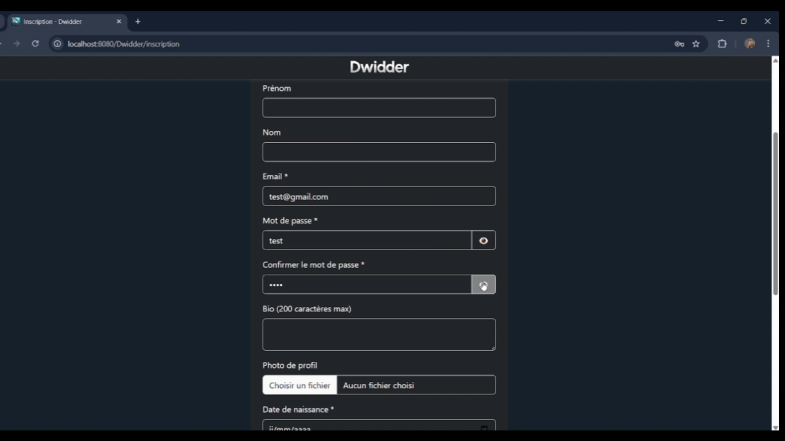

Une fois inscrit, l'utilisateur peut se connecter.
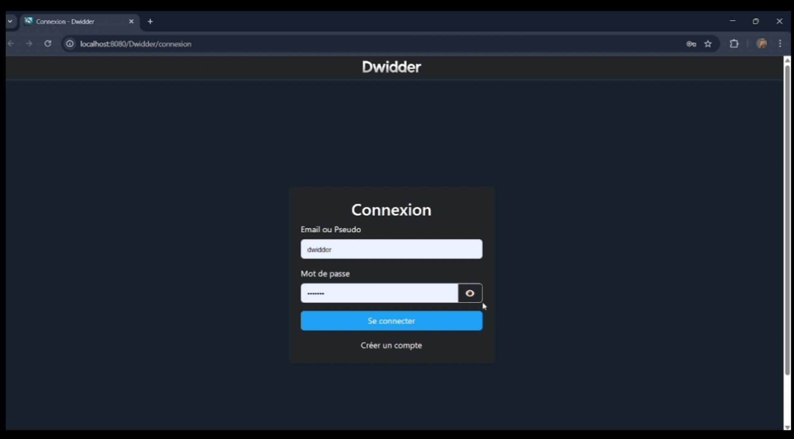

### Interface et Fil Public
Après connexion, l'utilisateur arrive sur la page d'accueil, accessible sur mobile et PC (site responsive avec Bootstrap). 
Le fil public affiche les posts de tous les utilisateurs qui ont posté dans ce fil.
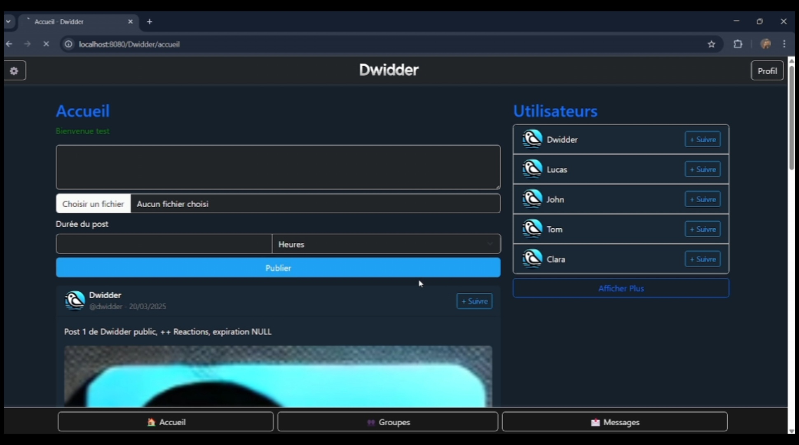

### Réactions, Commentaires et Ajout de Posts
Les posts peuvent être likés avec différentes réactions.
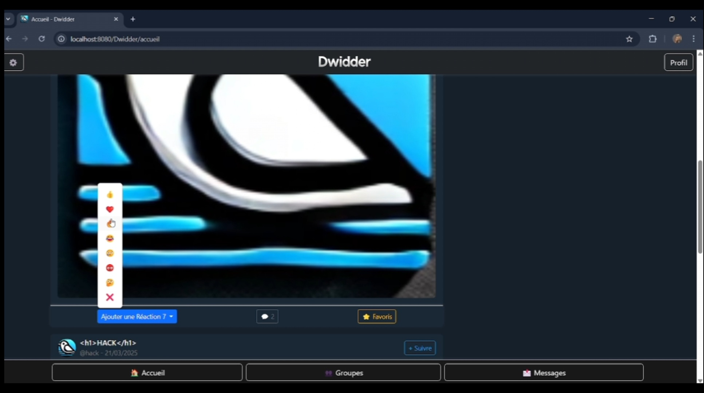

Les utilisateurs peuvent commenter les posts. Les commentaires sont triés par réactions, et chaque réponse permet de remonter au post d'origine.
Les utilisateurs peuvent publier des posts avec une durée limitée (suppression automatique) et ajouter des images.
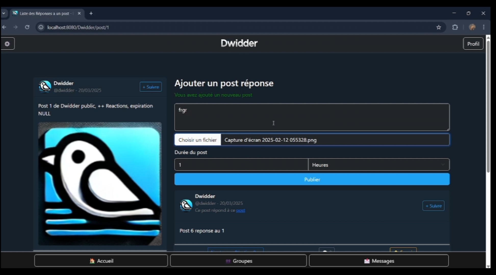

### Recherche et Profils
Une liste des utilisateurs est disponible avec une barre de recherche (par pseudo, identifiant ou description). Il est possible de s'abonner à d'autres utilisateurs.
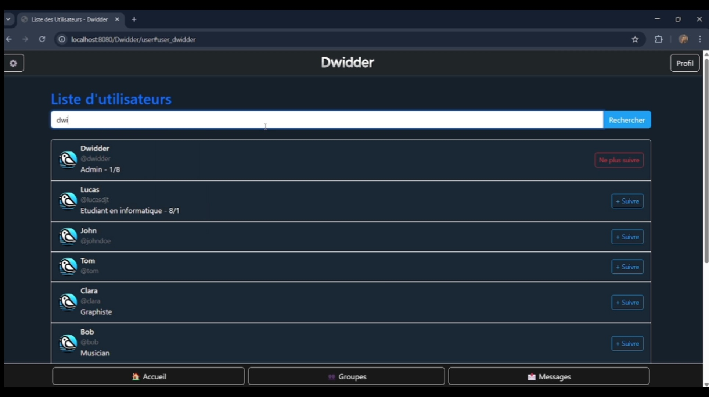

Sur un profil, on peut voir les abonnements, abonnés et publications. Il est aussi possible d'ajouter et supprimer des favoris.
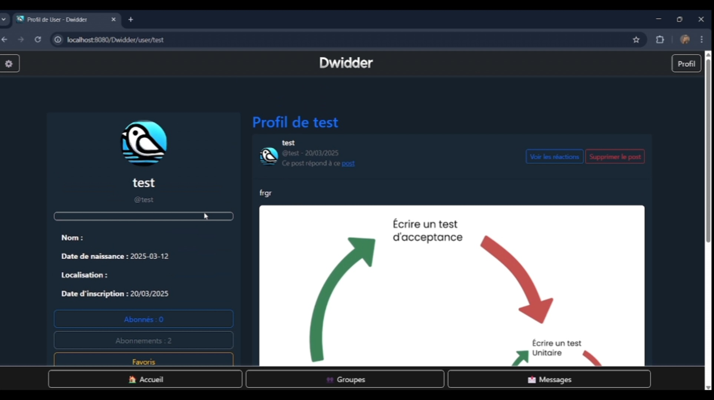

### Groupes
Les groupes permettent de partager des posts accessibles uniquement aux membres.

- Création d'un groupe avec image et description.
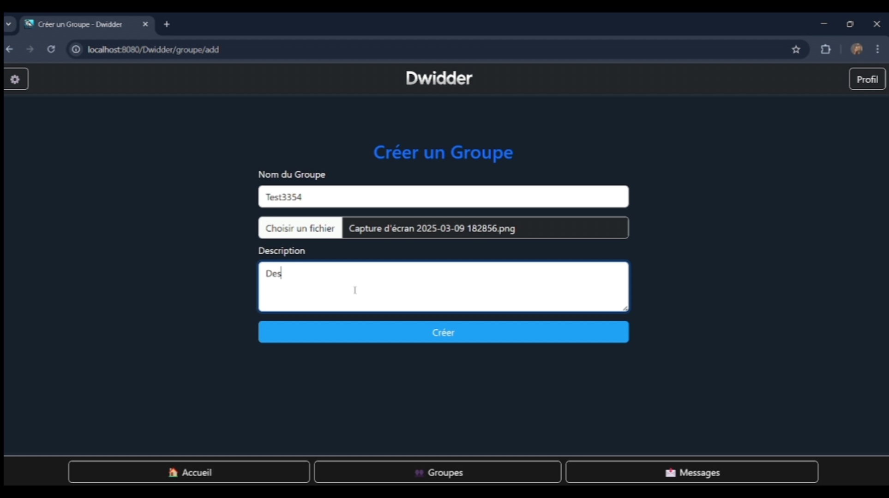

- Liste des groupes rejoints avec accès aux posts du groupe.
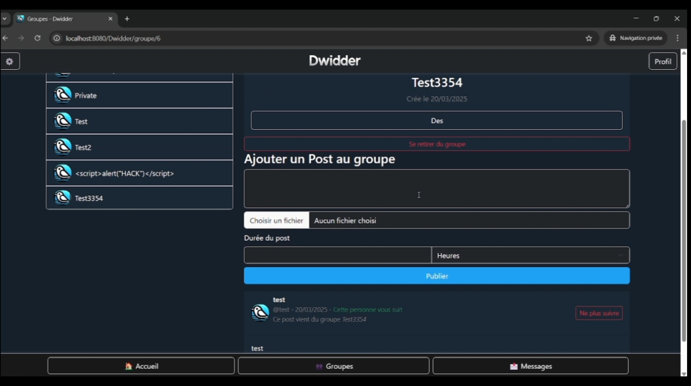

- Gestion des groupes : ajout de membres, changement d'administrateur, modification des infos ou suppression.
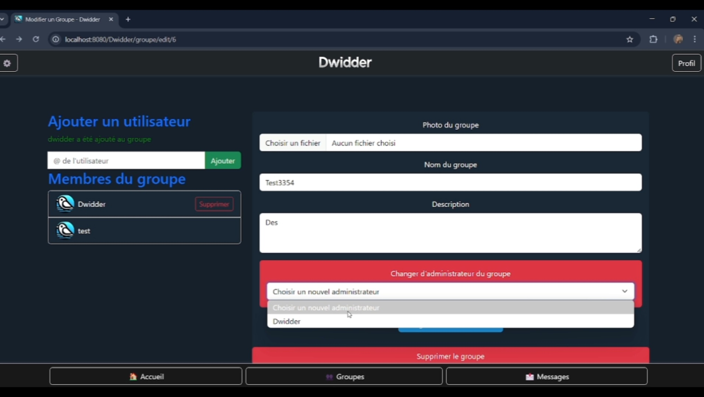

### Messages Privés
Les utilisateurs peuvent échanger des messages et envoyer des images.
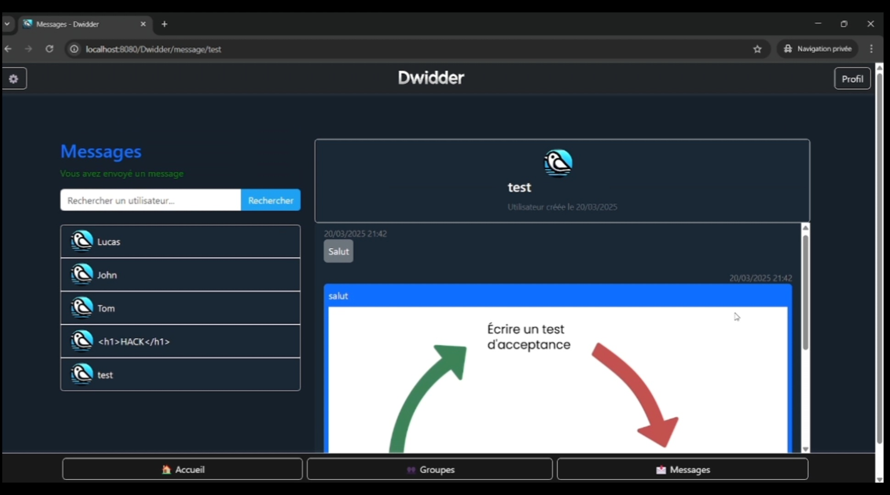

### Paramètres
Les utilisateurs peuvent modifier leurs informations, changer le tri des posts (par date ou réactions), se déconnecter ou supprimer leur compte.
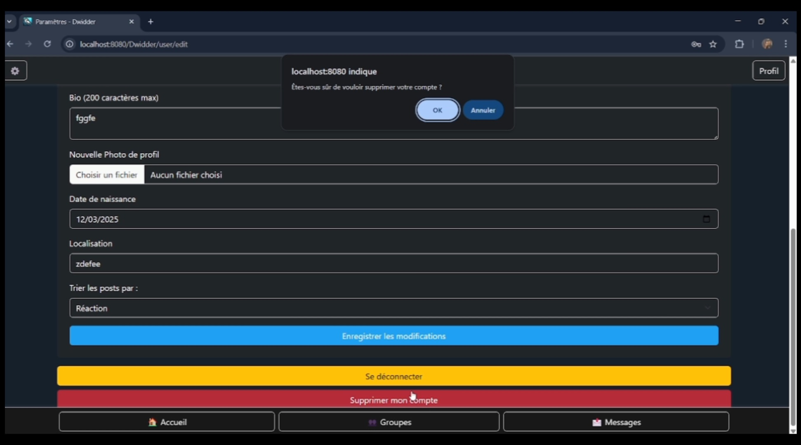

---

## 2. Administration
Les administrateurs accèdent à une interface via `.../Dwidder/Admin`.

Ils peuvent voir les logs du serveur et supprimer des comptes.
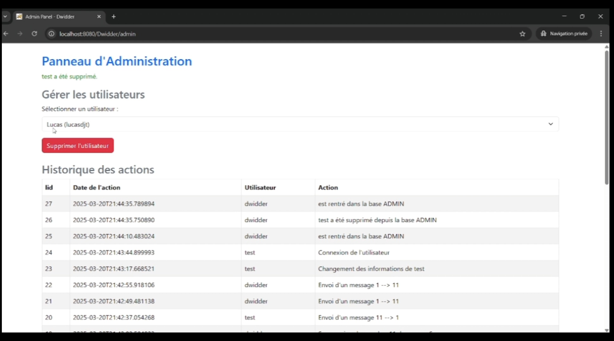

---

## 3. API REST
Pour les développeurs, Dwidder propose une API REST. Consultez le [README.md](README.md#utiliser-lapi-rest) pour plus de détails.

---

## 4. Conclusion
Dwidder est un réseau social complet avec une interface intuitive et de nombreuses fonctionnalités.

Si vous souhaitez collaborer sur ce projet ou développer une variante, contactez-moi !

### Idées d'évolutions possibles :
- Un réseau social pour les fans d'un genre musical.
- Une plateforme axée sur l'écologie.

Merci d'avoir lu ce guide et bon développement ! 🚀