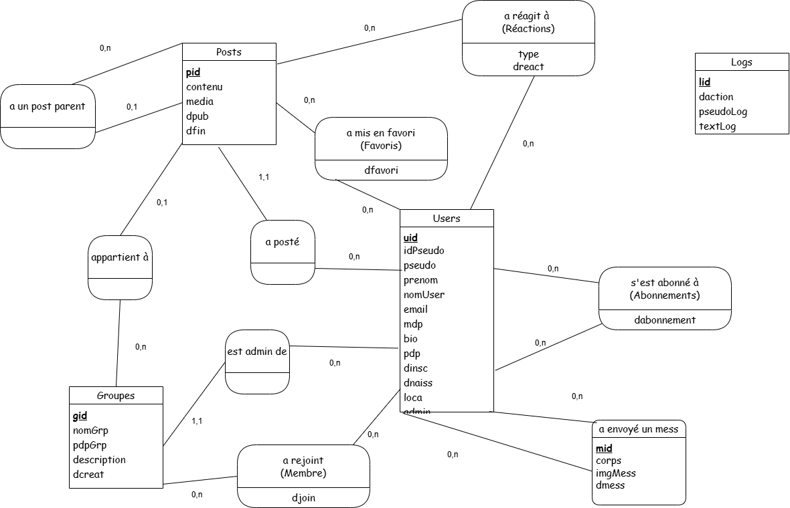

# PARTIE SQL

## SOMMAIRE
1. [MCD](#mcd)
2. [MLD](#mld)
3. [Requêtes SQL](#requêtes-sql)

## MCD



## MLD
> Users(**uid**, idPseudo, pseudo, prenom, nomUser, email, mdp, bio, pdp, dinsc, dnaiss, loca, admin) \
> Groupes(**gid**, #uid, nomGrp, pdpGrp, description, dcreat) \
> Posts(**pid**, #uid, #gid, #pidParent, contenu, media, dpub, dfin) \
> Messages(**mid**, #uidEnvoyeur, #uidReceveur, corps, imgMess, dmess) \
> Abonnements(**#uidAbonne**, **#uidAbonnement**, dabonnement) \
> Favoris(#uid, #pid, dfavori) \
> Reactions(#uid, #pid, type, dreact) \
> Membres(#uid, #gid, djoin) \
> Logs(**lid**, daction, pseudoLog, textLog)


## Requêtes SQL

- Trouver la date à laquelle un utilisateur s'est abonné à un autre utilisateur

    ```sql
    SELECT dabonnement 
    FROM Abonnements 
    WHERE uidAbonne = 1 AND uidAbonnement = 2
    ```

---

- Trouver la liste des membres d'un groupe triée par date d'adhésion décroissante

    ```sql
    SELECT U.* 
    FROM Membres M 
    JOIN Users U ON M.uid = U.uid 
    WHERE M.gid = 1
    ORDER BY M.djoin DESC
    ```

---

- Trouver la liste des posts sans groupe ni parent triés par date la plus récente

    ```sql
    SELECT * 
    FROM PostDetails 
    WHERE gid IS NULL AND pidParent IS NULL 
    ORDER BY dpub DESC
    ```

---

- Trouver la liste des posts sans groupe ni parent triés par le nombre de likes

    ```sql
    SELECT * 
    FROM PostDetails 
    WHERE gid IS NULL AND pidParent IS NULL 
    ORDER BY nbLikes DESC
    ```

---

- Trouver la liste des posts d'un groupe triés par date
    ```sql
    SELECT * 
    FROM PostDetails 
    WHERE gid = 1 AND pidParent IS NULL 
    ORDER BY dpub DESC
    ```

---

- Trouver les utilisateurs correspondant à un mot-clé
    ```sql
    SELECT * 
    FROM Users 
    WHERE LOWER(idPseudo) LIKE LOWER("lucas") 
        OR LOWER(pseudo) LIKE LOWER("draggas") 
        OR LOWER(bio) LIKE LOWER("etudiant")
    ```

---

- Trouver la liste des groupes rejoints par un utilisateur
    ```sql
    SELECT G.* 
    FROM GROUPES G 
    INNER JOIN Membres M ON G.gid = M.gid 
    WHERE M.uid = 1
    ```

---

- Trouver la liste des abonnés d'un utilisateur triés par date d'abonnement décroissante  
    ```sql
    SELECT U.* 
    FROM Abonnements A 
    JOIN Users U ON A.uidAbonne = U.uid 
    WHERE A.uidAbonnement = 1 
    ORDER BY A.dabonnement DESC
    ```

---

- Trouver la liste des messages échangés entre deux utilisateurs triés par date
    ```sql
    SELECT * 
    FROM Messages 
    WHERE (uidEnvoyeur = 1 AND uidReceveur = 2) 
        OR (uidEnvoyeur = 2 AND uidReceveur = 1) 
    ORDER BY dmess
    ```

---

- Trouver la liste des utilisateurs avec qui un utilisateur a conversé
    ```sql
    SELECT DISTINCT U.* 
    FROM Users U 
    JOIN Messages M ON (U.uid = M.uidEnvoyeur OR U.uid = M.uidReceveur) 
    WHERE (M.uidEnvoyeur = 1 OR M.uidReceveur = 1) AND U.uid != 1
    ```